# 2019 TRUST CTF

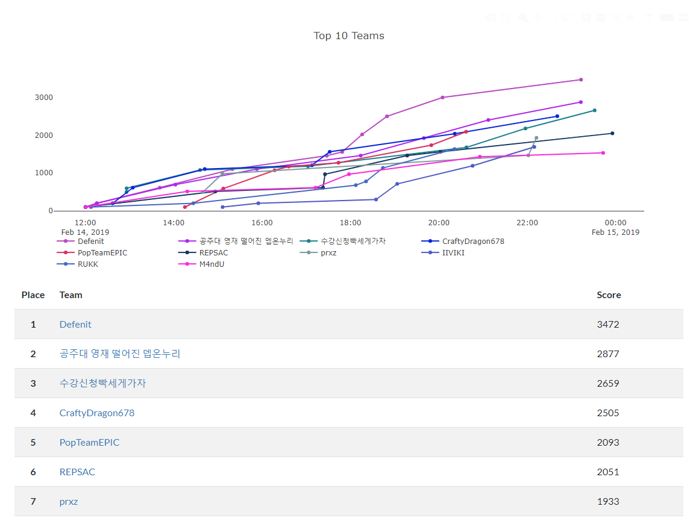
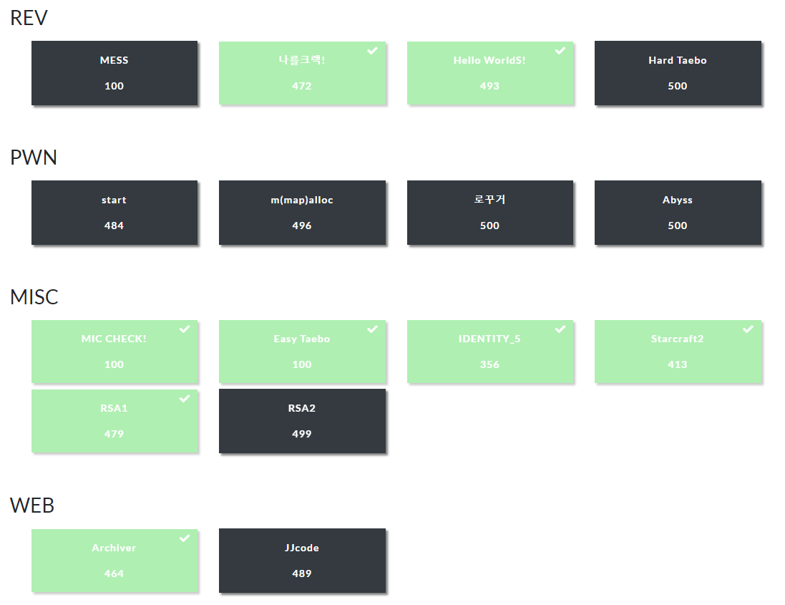

> 공주대 영재 떨어진 뎁온누리 (2nd place, 2877pts)

I've barely participated in any CTF, so I couldn't focus well on the challenge.

But, It was just as well that the result was not so bad :sunglasses:

~~Annnnd, I can't touch any pwnable chall lol~~

So, let the writeup begin.

## Web

### Archiver (464pts)

```
Oh, It seems like brand-new Archive system!

http://archiver.trustctf.com/

*The flag is in the /flag*

Author : c2w2m2
```

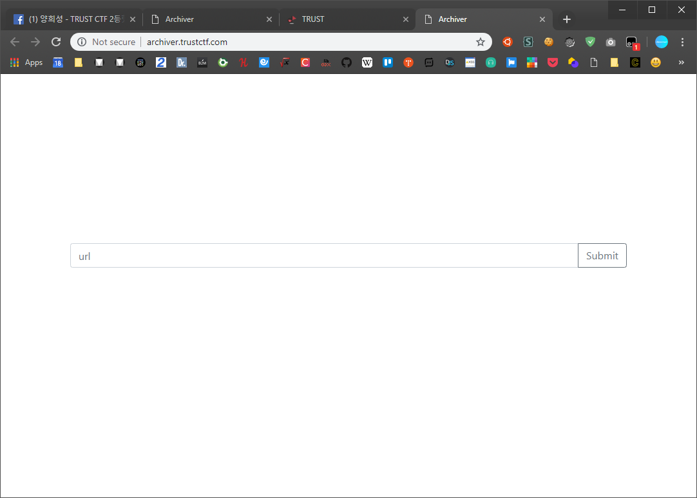

Thankfully, this chall gives us SOURCE CODE!

And, let's see `main.py` as the way we always do.

```py
#-*- coding: utf-8 -*-
from flask import Flask, request, render_template, redirect, url_for
import requests
import time
import glob
import sys
import util
import os

reload(sys)
sys.setdefaultencoding('utf-8')

app = Flask(__name__)

@app.route('/', methods=['GET'])
def main():
    return render_template('index.html')

@app.route('/listArchive', methods=['POST'])
def listArchive():
    url = request.form['url']
    hashed = util.hashing(url)
    files = glob.glob('%s/%s/*' % (app.config['path'], hashed))
    res = []
    for i in files:
        T = int(i[i.rfind('/')+1:])
        res.append(T)
    res.sort()
    res = res[::-1]
    return render_template('archive.html', url=url, res=res)

@app.route('/saveArchive', methods=['POST'])
def saveArchive():
    url = request.form['url']
    T = int(time.time())
    
    try:
        res = requests.get(url)
    except:  
        return util.alert("Error!")
    
    if res.status_code != 200:
        return util.alert("code is not 200")
    
    data = unicode(res.text)
    hashed = util.hashing(url)

    os.system("mkdir %s/%s" % (app.config['path'], hashed))
    fd = open('%s/%s/%s' % (app.config['path'], hashed, str(T)), 'w')
    fd.write(data)
    fd.close()

    return redirect(url_for('main'))
    
@app.route('/viewArchive', methods=['POST'])
def viewArchive():
    url    = request.form['url']
    T      = request.form['T']
    hashed = util.hashing(url)

    fd = open('%s/%s/%s' % (app.config['path'], hashed, str(T)), 'r')
    data = unicode(fd.read())
    fd.close()
    return render_template('view.html', data=data)
    
@app.template_filter()
def setdatetime(T):
    T = time.gmtime(T)
    return '%04d-%02d-%02d %02d:%02d:%02d' % (T.tm_year, T.tm_mon, T.tm_mday, T.tm_hour, T.tm_min, T.tm_sec)


app.config['path'] = util.getRandPath()
os.system('mkdir %s' % app.config['path'])
app.run(host='0', port=4432, debug=False)
```

I think the author worked hard to make this chall.

By the way, let's take a look at viewArchive which can read file because we need to read /flag.

We can't actually manipulate the url part due to hashing function, but thankfully it doesn't hash or filter timestamp, so we can read any file that we want.

Then, we can find the flag, traversing backward.


Input any website and enter JavaScript code with flag location that goes to specific time of archive.


```
FLAG: TRUST{Easy_Local_file_traversal_N3xt_t1me_i_1l_us3_DB..:(}
```

## Reversing

### MESS (100pts)

Let's take a look at the Hex-rays pseudo-code.


Compare the value added by 5 in Str1 and input value added by 5 (i.e. the same as just comparing it with Str1).

If two string is exactly same, then do XOR and plus operation and print it out.

And, look at the Str1.

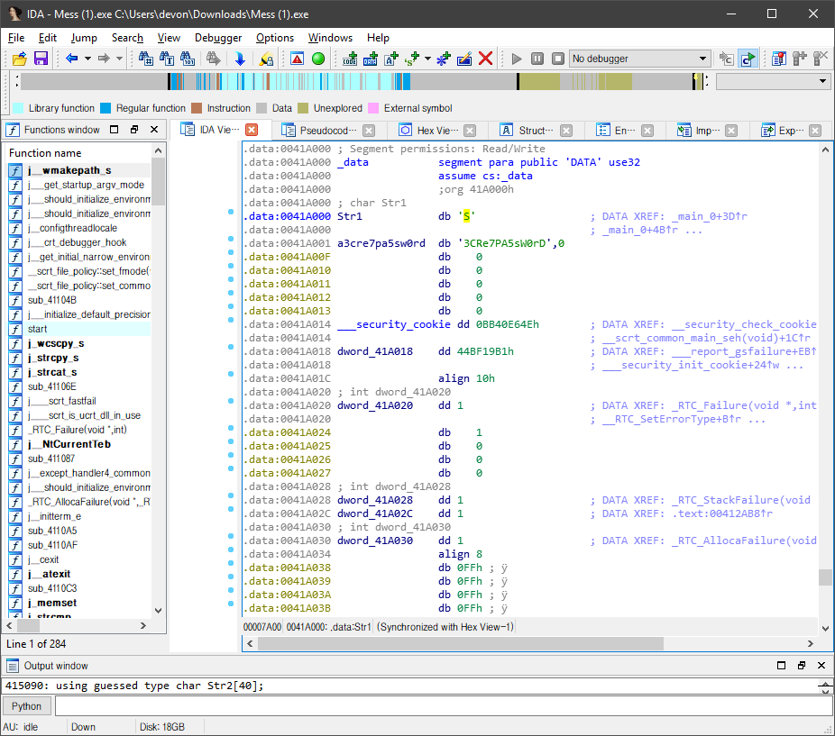

Then, let's type `S3CRe7PA5sW0rD` and inspect what's going on next.

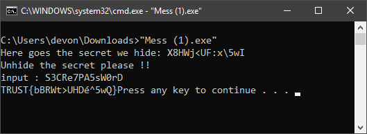

But, the range of this particular character could be different depending on charset, but the result is below as cp949.

(I can't say it's a good chall..)

```
FLAG: TRUST{bBRWt>UHDé^5wQ}
```

### Crack me! (472pts)


It was packed with ConfuserEx. Let's open it with dnSpy.

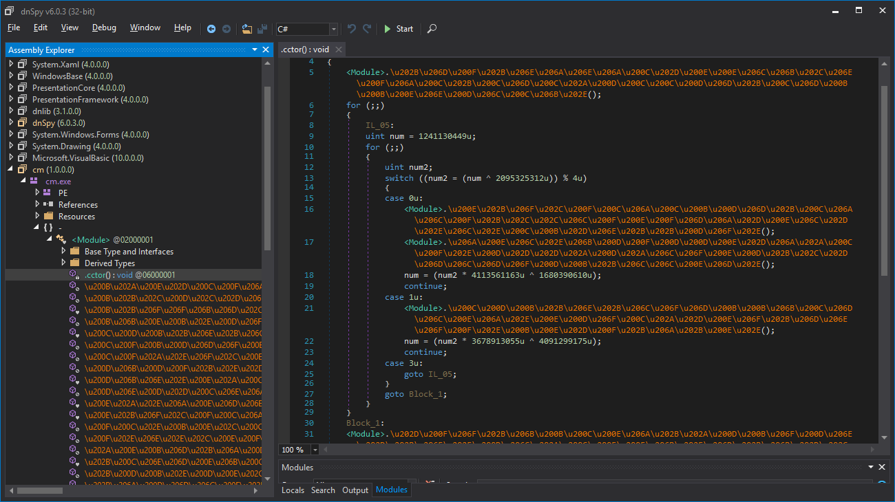

It's a cctor of the module. I don't want to see it.

It seems like AntiTamper function when we enter the function on line 5.

In this case, we can just pick the module that AntiTamper code has processed.


Set a breakpoint after the AntiTamper code, and click `Open Module from Memory`

When you get around in the (slightly) deobfuscated module, you can find forms and some code about Clipbaord.

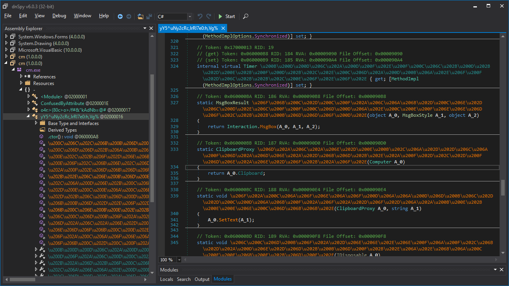

Then.. I suddenly figure out that the number of solvers is quite a lot even It was packed with ConfuserEx.

With my intuition, I run it right away, click the button and paste it into Notepad.

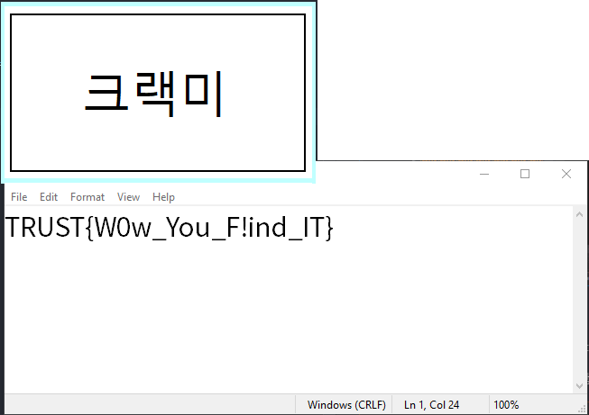

```
FLAG: TRUST{W0w_You_F!ind_IT}
```

### Hello WorldS! (493pts)

```
So many "Hello World" programs....

dukup11ch1 made 8 programs

you just find his programs and write "Yara rule" 

nc server.trustctf.com 5252

(Code the rule in one line.)

Author : dukup11ch1(유기환)
```

I don't really know what the Yara is, so I refer to [HERE](https://yara.readthedocs.io/en/v3.4.0/writingrules.html).

```py
import yara

rule = input("Input your rule... ")

try:
    crule = yara.compile(source=rule)
except yara.SyntaxError:
    print("SystaxError!")
    exit()
except:
    exit()
count = 0
filelist=["1.exe", "2.exe", "3.exe", "4.exe", "5.exe", "6.exe", "7.exe", "8.exe", "9.exe", "10.exe", "11.exe", "12.exe", "13.exe", "14.exe", "15.exe", "16.exe"]
myfile=["6.exe", "7.exe", "8.exe", "9.exe", "10.exe", "11.exe", "13.exe", "14.exe"]
notmine=["1.exe", "2.exe", "3.exe", "4.exe", "5.exe", "12.exe", "15.exe", "16.exe"]
for file in filelist:
    fp = open('/home/ctf/' + file,'rb')
    fdata=fp.read()
    matches = crule.match(data=fdata)
    if (file in myfile and matches != []):
        count = count+1
        #print(file)
    elif file in notmine and matches == []:
        count = count+1
        #print(file)
    fp.close()
if count == 16:
    print("TRUST{EXAMPLE_FLAG}")
```


Looking at the code, the files in the `myfile` list should be matched, and the files in `notmine` should not.

Then, let's find the `myfile` files in common.

`8.exe` and `13.exe`is both 10240 bytes, and `6.exe 7.exe 9.exe 10.exe 11.exe 14.exe` have `3C 2C 3C 7F 78 4D 52 2C 78 4D 52 2C 78 4D 52 2C 71 ...` common bytes.

Then let's write a yara rule based on it.

```
rule dummy
{
    strings:
        $a = { 3C 2C 3C 7F 78 4D 52 2C 78 4D 52 2C 78 4D 52 2C 71 35 C1 2C 72 4D 52 2C AA 29 53 2D 7B 4D 52 2C AA 29 51 2D 79 4D 52 2C AA 29 57 2D 6A 4D 52 2C AA 29 56 2D 75 4D 52 2C 1D 2B 53 2D 7A 4D 52 2C 78 4D 53 2C 55 4D 52 2C 93 29 5B 2D 7A 4D 52 2C 93 29 AD 2C 79 4D 52 2C 93 29 50 2D 79 4D 52 2C 52 69 63 68 78 4D 52}
    condition:
       filesize == 10240 or $a
}

// In one line
rule dummy { strings: $a = { 3C 2C 3C 7F 78 4D 52 2C 78 4D 52 2C 78 4D 52 2C 71 35 C1 2C 72 4D 52 2C AA 29 53 2D 7B 4D 52 2C AA 29 51 2D 79 4D 52 2C AA 29 57 2D 6A 4D 52 2C AA 29 56 2D 75 4D 52 2C 1D 2B 53 2D 7A 4D 52 2C 78 4D 53 2C 55 4D 52 2C 93 29 5B 2D 7A 4D 52 2C 93 29 AD 2C 79 4D 52 2C 93 29 50 2D 79 4D 52 2C 52 69 63 68 78 4D 52} condition: filesize == 10240 or $a }
```

Write it as above and send it to nc server, and tada! We can see our flag!


```
FLAG: TRUST{I9n0re_PDB_R1CH_I'm_s0rry_TT}
```

## Misc

### MIC CHECK! (100pts)

```
Welcome to 1st TRUST CTF!

Please read Notifications and Rules!

Discord : https://discord.gg/ZYyupm8

Flag : TRUST{Welcome_CTF_Have_FUN!}
```

```
FLAG: TRUST{Welcome_CTF_Have_FUN!}
```

### Easy Taebo (100pts)

```
Do Taebo in TRUST CTF!

nc server.trustctf.com 44923

Author : st4nw
```

Taebo is the combination of Taekwondo and Boxing. It has been a meme quite a lot. If you want to know what it is, go and see [Wikipedia](https://en.wikipedia.org/wiki/Tae_Bo).

Let's do taebo! @==(^o^)@

It gives a action list as below.

```
'left_jab' : '@==(^0^)@'
'left_mid_jab' : '@=(^0^)@'
'mid_jab' : '@(^0^)@'
'right_mid_jab' : '@(^0^)=@'
'right_jab' : '@(^0^)==@'
'left_hook' : '@(^0^)@=='
'right_hook' : '==@(^0^)@'
'left_speedball' : '@@@(^0^)'
'right_speedball' : '(^0^)@@@'
'left_kick' : '@||(^0^)==@'
'mid_kick' : '@==(^||^)==@'
'right_kick' : '@==(^0^)||@'
```

And, we can write simple code with it!

```py
from pwn import *
from time import sleep

context.log_level = 'DEBUG'

r = remote('server.trustctf.com', 44923)
r.recvuntil('Ready : Taebo starts in 3 seconds\n\n')
sleep(4)

for i in range(100):
    r.recvuntil('Taebo ')
    line = r.recvuntil(' >> ')
    line = line.split(' : ')[1][:-4]
    log.info(line)
    tblist = line.split(' + ')
    tbskill = {
    'left_jab': '@==(^0^)@',
    'left_mid_jab': '@=(^0^)@',
    'mid_jab': '@(^0^)@',
    'right_mid_jab': '@(^0^)=@',
    'right_jab' : '@(^0^)==@',
    'left_hook' : '@(^0^)@==',
    'right_hook' : '==@(^0^)@',
    'left_speedball' : '@@@(^0^)',
    'right_speedball' : '(^0^)@@@',
    'left_kick' : '@||(^0^)==@',
    'mid_kick' : '@==(^||^)==@',
    'right_kick' : '@==(^0^)||@'
    }

    result = ""
    for tb in tblist:
        result += tbskill[tb] + " "
    r.recv()
    r.sendline(result.strip())
r.recvuntil('}')
```

It kinda *works*, but I can't tell that this is the best code :P

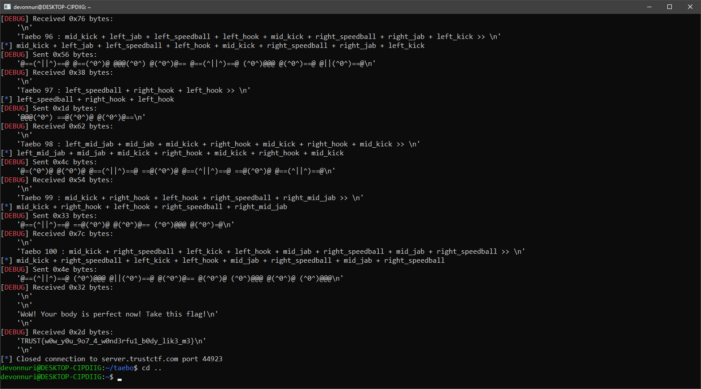

```
FLAG: TRUST{w0w_y0u_9o7_4_w0nd3rfu1_b0dy_lik3_m3}
```

### IDENTITY_5 (356pts)

```
The real filename is identity_5.apk. Remove the .zip.
I recommend execute it!!! and input "trust", "TRUST", "flag"!!!! have a good luck :)

flag3 : https://bit.ly/2S7lqhH

Author : m0nday(이동준)
```

Let's take a look at the code that decompiled with jadx.

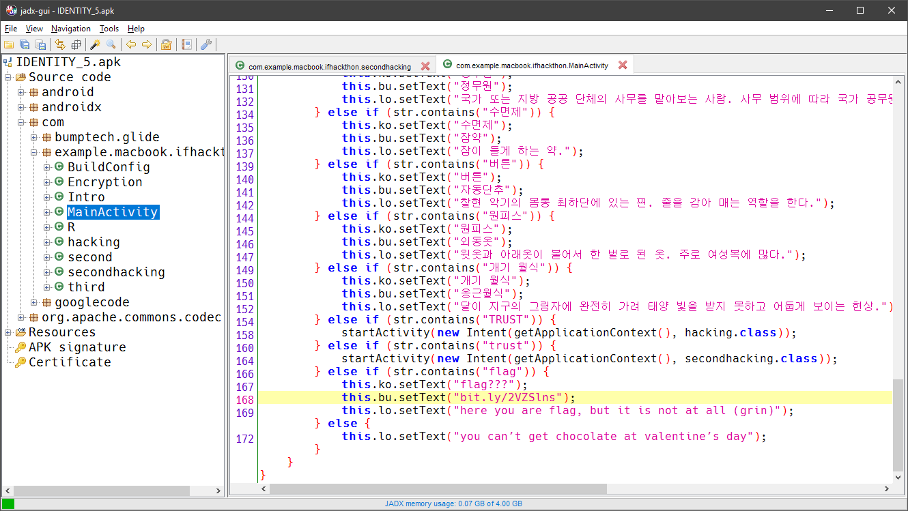

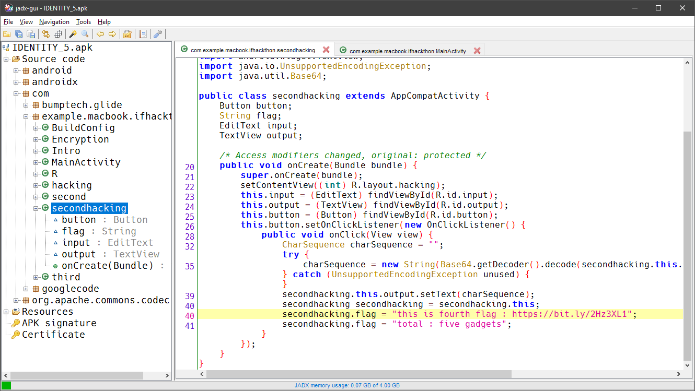

And, check the resource with apktool.


Gather all of the QR codes (includes that in the description).


Scan all of the QR codes, join and we can finally see the flag!

```
FLAG: TRUST{Th1s_1s_fl@g_@ndr0id_@add_Qrc0d3}
```

### Starcraft2 (413pts)

```
SC2 is What?

Author : dukup11ch1(유기환)
```

A lot of time has passed to get the Starcraft. At first, I was worried because the editor didn't open, but I realized that I had to wait.

With a little patience, we can see flag in the minimap.

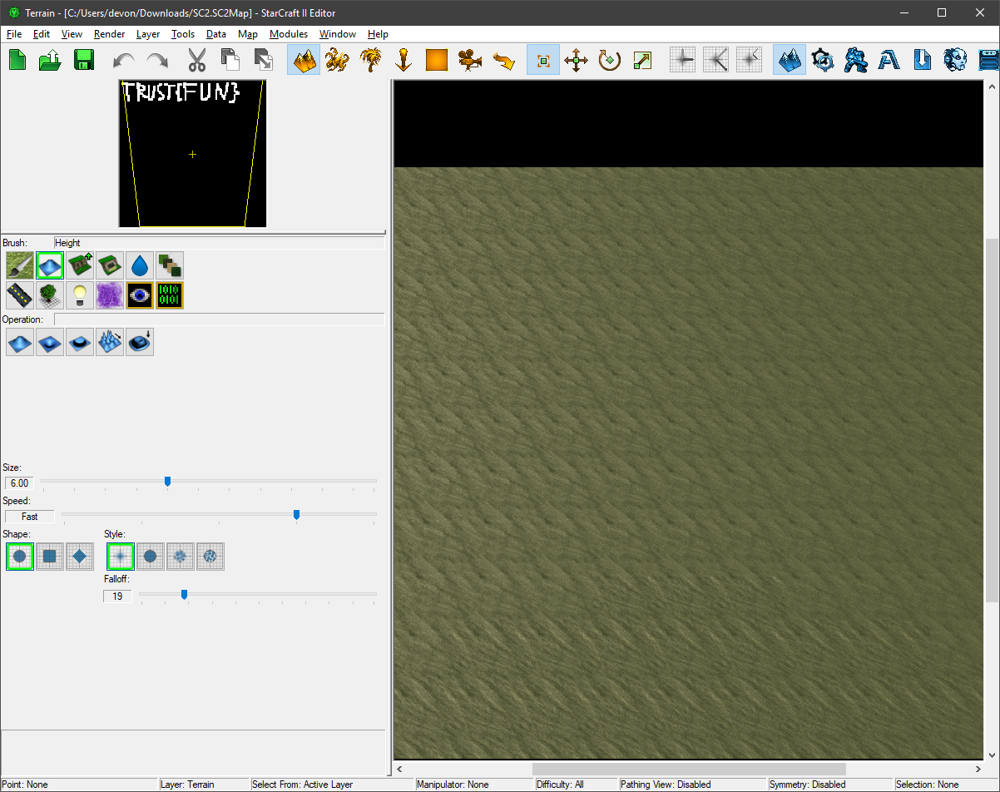

```
FLAG: TRUST{FUN}
```

### RSA1 (479pts)

```
RSA Cipher : 1649729212658550722856763813613372
Prime 1 that used for encryption : 36465956589847261
Prime 2 that used for encryption : 46496464168468673
Decryption Key : 1275312736838027047985273062147003 
Flag Format: TRUST{~Plain text~}

Author : 생선스프 (For ask : m0nday)
```

I have no information about RSA. But, I could find some information in [dcode.fr](https://www.dcode.fr/rsa-cipher)


Run it with python, split it every two characters, convert them into ascii, join and then we can see flag!


```
FLAG: TRUST{ASR_W0NK_U0Y_Y@Y}
```
